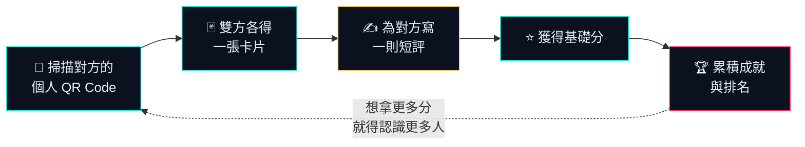
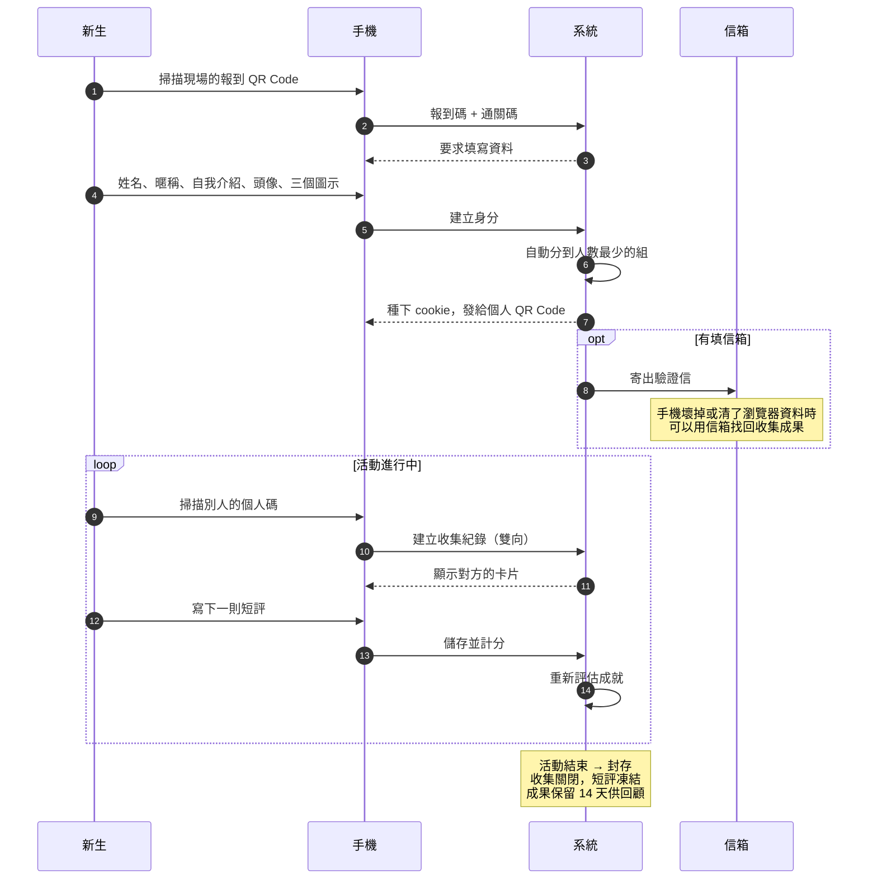
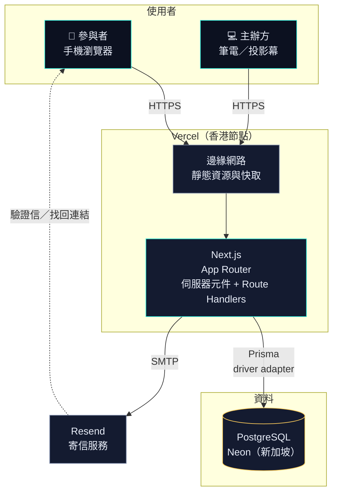
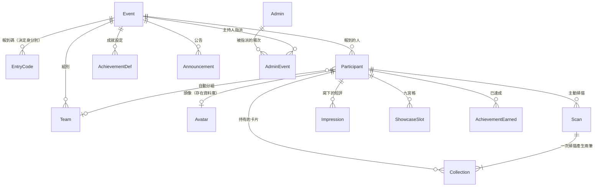

# NCUIM 新生茶會 · 卡片收集

一場實體活動用的手機網頁。新生在現場互相掃描 QR Code 收集彼此的卡片，
為對方寫下一句短評，累積分數與成就——目的是讓「你好我是誰」這件事
有個具體的理由發生。

**不需要下載 App，不需要註冊帳號。** 掃一下報到碼，填完資料就開始玩。

---

## 這是什麼樣的遊戲

### 核心循環

兩個人見面，其中一人掃描對方的個人 QR Code。**一次掃描，雙方都拿到對方的卡片**
——誰主動掃的不影響誰拿到什麼，但系統會記得是誰先開口。

拿到卡片之後，要為對方寫一則 50 字以內的短評。**寫了才有分數。**
這是刻意的設計：如果掃了就給分，最有效率的策略會變成「見人就掃、一句話都不用說」，
那正是這個活動想避免的。



### 短評是給收件人的，不是公開的

你寫給別人的話，**只有那個人看得到**，而且看得到是你寫的。

收到的短評會出現在你的「浮光牆」上——每一則是一根直排的字柱，分三層景深
等速流過，可以拖住留置閱讀。那是私人的一頁，只有你自己看得到。

不喜歡某一則可以隱藏，也可以一併回報給主辦方。

### 分數怎麼來

| 來源 | 說明 |
| --- | --- |
| **基礎分** | 每收集一個人並**寫下短評**得一次，雙方對等 |
| **成就分** | 達成主辦方設定的目標，分值逐場自訂 |

預設的七個成就：

| 成就 | 條件 | 分數 |
| --- | --- | --- |
| 早鳥 | 開放收集後 15 分鐘內完成第一次掃描 | 30 |
| 找到隊友 | 收集到 1 位同組隊員 | 40 |
| 破冰者 | 主動掃描 5 個人 | 50 |
| 幹部獵人 | 掃描到 3 位工作人員 | 80 |
| 人氣王 | 被 10 個人收集 | 100 |
| 社交高手 | 主動掃描 15 個人 | 150 |
| 集齊全隊 | 收集到全隊所有人 | 200 |

成就可以設為隱藏——達成前只顯示「隱藏成就」，不透露條件也不顯示進度。
**已達成的成就永不撤銷**，即使主辦方之後調高門檻（[ADR-0002](docs/adr/0002-achievements-are-never-revoked.md)）。

### 九宮格

從收集到的卡片中挑最多九張放進公開的展示格。被你放進九宮格的人，
他寫給你的短評會在你的浮光牆上更顯眼。

系統**不提供**「我被幾個人放進九宮格」的反向查詢——那會把它變成另一種人氣競賽。

---

## 參與者會走過的流程



**為什麼沒有登入畫面**：報到人潮集中在活動剛開始的十幾分鐘，任何帳號密碼
流程都會直接卡住動線。身分繫於這一場活動、存在瀏覽器的 cookie 裡，
不跨場次延續（[ADR-0001](docs/adr/0001-per-event-identity-without-accounts.md)）。

---

## 主辦方看到的

### 活動戰情室

給筆電或投影幕的即時全景。每位參與者是一個節點（**分數愈高愈大**），
每一次相遇是一條連線。新的掃描會在兩端炸開漣漪，解鎖成就則是金色的爆發
——等級愈高愈盛大，並在那個節點上打出成就名稱。

左欄是統計與主動掃描排行，右欄是即時動態與完整排名。整張網可以縮放平移。

### 後台

- 參與者清單與詳細資料（含只有主辦方看得到的真實姓名）
- 成就的新增與調整，可就地修改
- 發布公告
- 查看任一位參與者的浮光牆與九宮格（處理違規內容用）
- 移除違規的頭像或暱稱——**會立即從所有人的收集清單消失**
- 封存活動、清除個資

---

## 系統架構



**相機需要 HTTPS。** 瀏覽器只在安全來源開放 `getUserMedia`，所以連本機
實機測試都要走隧道（`npm run tunnel`）——這是 [ADR-0004](docs/adr/0004-tech-stack.md)
記下的限制。

備用方案是 GCP Cloud Run + Cloud SQL，完整步驟在 [GCP/OPERATION_GCP.md](GCP/OPERATION_GCP.md)。

### 資料模型



**一次 Scan 產生兩筆 Collection** 是這個模型的核心：持有關係對稱（雙方各得一張卡），
但誰主動發起只記在 Scan 上。`(eventId, pairKey)` 的唯一鍵讓 A→B 與稍後的 B→A
被視為同一次相遇，不會重複計算。

---

## 技術棧

| | |
| --- | --- |
| 框架 | Next.js 16（App Router、伺服器元件） |
| 語言 | TypeScript |
| 資料庫 | PostgreSQL 17 + Prisma 7（driver adapter） |
| 樣式 | Tailwind CSS 4 |
| QR 掃描 | `@zxing/browser` |
| 寄信 | Nodemailer + Resend |
| 測試 | `node:test`（210 項）+ 煙霧測試 + 全流程彩排 |

### 三個值得一提的實作

**QR Code 必須是深色在淺色上。** `@zxing/browser` 解不了反相的 QR
（淺色圖案在深色底），而整個介面是深色主題——這個坑用一支解碼測試釘住了
（`tests/qr-scannable.test.mts`）。

**分組用 advisory lock 序列化。** 交易本身不夠：PostgreSQL 預設的 READ COMMITTED
讓併發報到讀到同一份人數、各自挑中同一組。實測七十人同時報到會跑成
`5,5,5,5,6,8,9,9,9,9`，加鎖後是完美的十組各七人。

**測試不會真的寄信。** `sendMail` 偵測到連著測試資料庫時只記 `SKIPPED`——
測試用的是 `@example.com` 這種不收信的保留網域，真的寄出去每一封都會退信，
而退信會扣寄件網域的信譽分。

---

## 開始開發

```bash
npm install
cp .env.example .env     # 至少要有 DATABASE_URL
npm run db:up            # 啟動 Docker 裡的 PostgreSQL
npm run db:push          # 建立資料表
npm run db:seed          # 示範活動與管理員
npm run dev              # http://localhost:3000
```

完整的操作說明、測試方式、實機測試、活動當天流程與疑難排解，全部在
**[OPERATION.md](OPERATION.md)**。

領域詞彙與設計決策在 **[CONTEXT.md](CONTEXT.md)**——修改任何功能之前
值得先讀它，那裡定義了「Scan 和 Collection 為什麼不是同一件事」這類
會影響實作正確性的區分。

### 常用指令

| 指令 | 用途 |
| --- | --- |
| `npm run dev` | 開發伺服器 |
| `npm test` | 全部測試（需先 `npm run dev:test`） |
| `npm run smoke` | 煙霧測試 |
| `npm run rehearsal` | 全流程彩排 |
| `npm run tunnel` | HTTPS 隧道（實機測試相機用） |
| `npm run ttfb -- <網址>` | 量延遲與執行位置 |
| `npm run loadtest -- <網址> <報到碼> <通關碼>` | 壓力測試 |
| `npm run mail:test -- <信箱>` | 寄一封測試信 |
| `npm run admin:create` | 建立總管理員（正式環境用） |

---

## 設計決策

四份 ADR 記錄了會影響整個系統的取捨：

- **[ADR-0001](docs/adr/0001-per-event-identity-without-accounts.md)** 身分繫於單場活動，不建立帳號系統
- **[ADR-0002](docs/adr/0002-achievements-are-never-revoked.md)** 已達成的成就永不撤銷
- **[ADR-0003](docs/adr/0003-impressions-are-attributed-and-private.md)** 短評一律具名，且僅收件人可見
- **[ADR-0004](docs/adr/0004-tech-stack.md)** 技術棧與相機的安全來源限制

## 隱私

這個系統持有兩樣個資：**真實姓名**與**信箱**。兩者都只有主辦方看得到，
不會出現在任何對外的畫面或 API。

活動封存後保留 14 天供大家回顧收集成果，期滿執行 `npm run db:purge` 清除。
對外公開的排行榜（如果主辦方選擇開啟）只包含名次、暱稱與分數。
